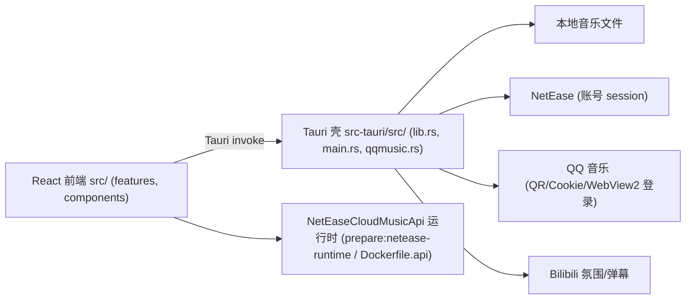

# Ome Music — Architecture（L1 导航，细节以代码为准）

基于真实目录/配置/提交证据整理（2026-09-09）。

## System Overview

## Component Relationships

- 前端按 features 组织（播放、搜索、设置、歌词/氛围）；跨端调用走 Tauri command。
- QQ 音乐登录逻辑独立成模块（qqmusic.rs），支持 QR / Cookie / WebView2 三路。

## Data Flow

登录凭据/session → 本地凭据存储（PersonalConfig/，敏感）→ 播放/搜索请求 → 音频流 → 前端播放器；歌词/封面/弹幕随曲目拉取。

## External Dependencies

NetEase API 运行时（NeteaseCloudMusicApi）· WebView2（QQ 登录）· Bilibili Web 接口 · 各平台账号 session

## Constraints（来自 README/AGENTS，必须遵守）

- 不绕过会员、版权、地区或平台访问规则。
- 保持轻量克制：避免大依赖、重复设置、超出问题的架构；依赖变更需先征得同意。
- 凭据/session 不读取、不打印、不外传（PersonalConfig/）。
