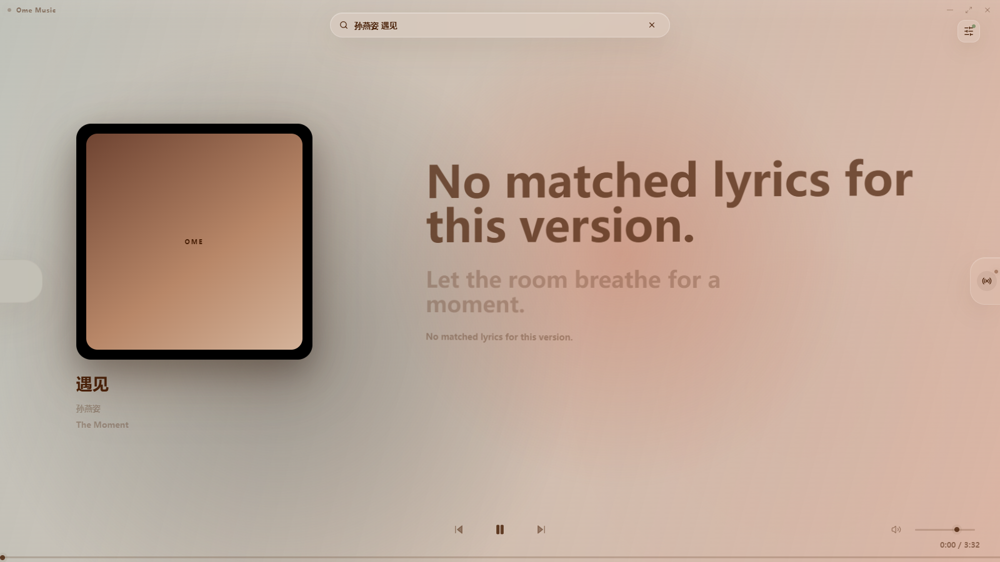
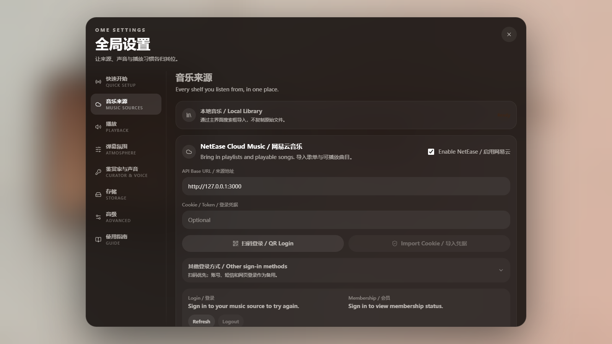

# Ome Music

English | [中文](./README.zh-CN.md)

A lightweight, immersive desktop music player with NetEase Cloud Music, Bilibili music source, video atmosphere, global danmaku, lyrics, and a private music curator experience.

Ome Music is built for local-first listening. It opens quickly, keeps personal data on your device by default, and keeps technical configuration behind a calm music-focused interface.

## Highlights

- Immersive desktop music player
- Local music import and playback
- NetEase Cloud Music source
- Bilibili music source
- Bilibili video atmosphere
- Global danmaku atmosphere layer
- Lyrics display and timing offset
- Lightweight settings system
- Private DJ / Music Curator experience
- SQLite local library and listening history
- Tauri-based lightweight desktop app

## Screenshots





Only commit screenshots that are safe for public display. Do not include API keys, cookies, account names, private playlists, logs, local paths, or personal listening history.

## Installation

Download the latest Windows build from the [GitHub Releases page](https://github.com/zerolyx/ome-music/releases).

Recommended file:

- `Ome Music_0.1.0_x64-setup.exe`: Windows NSIS installer

This project is currently distributed as an unsigned development release, so Windows may show a security warning on first launch.

## Build From Source

### Requirements

- Windows 10/11
- Node.js
- Rust stable toolchain
- Tauri CLI through `@tauri-apps/cli`
- Microsoft Edge WebView2 Runtime

### Install dependencies

```bash
npm install
```

### Run the desktop app in development

```bash
npm run desktop
```

Equivalent Tauri command:

```bash
npm run tauri dev
```

### Build the frontend

```bash
npm run build
```

### Build the Windows release

```bash
npm run release:windows
```

Equivalent Tauri command:

```bash
npm run tauri build
```

Tauri builds the frontend from `dist` and packages the app without requiring a development server.

## Configuration

Ome Music does not include built-in API keys, cookies, passwords, or tokens.

Configure sources inside the app:

- NetEase Cloud Music: API base URL, login session, optional cookie import
- Bilibili: public search, optional login session/cookie for account-only content
- Curator / API Provider: OpenAI-compatible provider name, base URL, API key, and model
- Voice: optional speech-to-text and text-to-speech providers

See [docs/CONFIGURATION.md](docs/CONFIGURATION.md).

## Security and Privacy

- Do not commit API keys.
- Do not commit cookies or login sessions.
- Do not commit local databases.
- Do not commit cache, logs, screenshots, or release binaries.
- Local music files are referenced by path and are not uploaded.
- Sessions and credentials are intended to stay on the user's local machine.

See [docs/PRIVACY.md](docs/PRIVACY.md) and [SECURITY.md](SECURITY.md).

## Disclaimer

This project is for personal learning and local music experience only.

Ome Music does not provide, host, store, distribute, or bypass access to copyrighted music. NetEase Cloud Music, Bilibili, and any third-party content remain the property of their respective platforms and rights holders. Users are responsible for complying with applicable laws and each platform's terms of service.

## Documentation

- [Configuration](docs/CONFIGURATION.md)
- [Build Guide](docs/BUILD.md)
- [Privacy](docs/PRIVACY.md)
- [Troubleshooting](docs/TROUBLESHOOTING.md)
- [Contributing](CONTRIBUTING.md)
- [Security Policy](SECURITY.md)
- [Third-party Notices](THIRD_PARTY_NOTICES.md)

## License

Ome Music is released under the MIT License. See [LICENSE](LICENSE).
