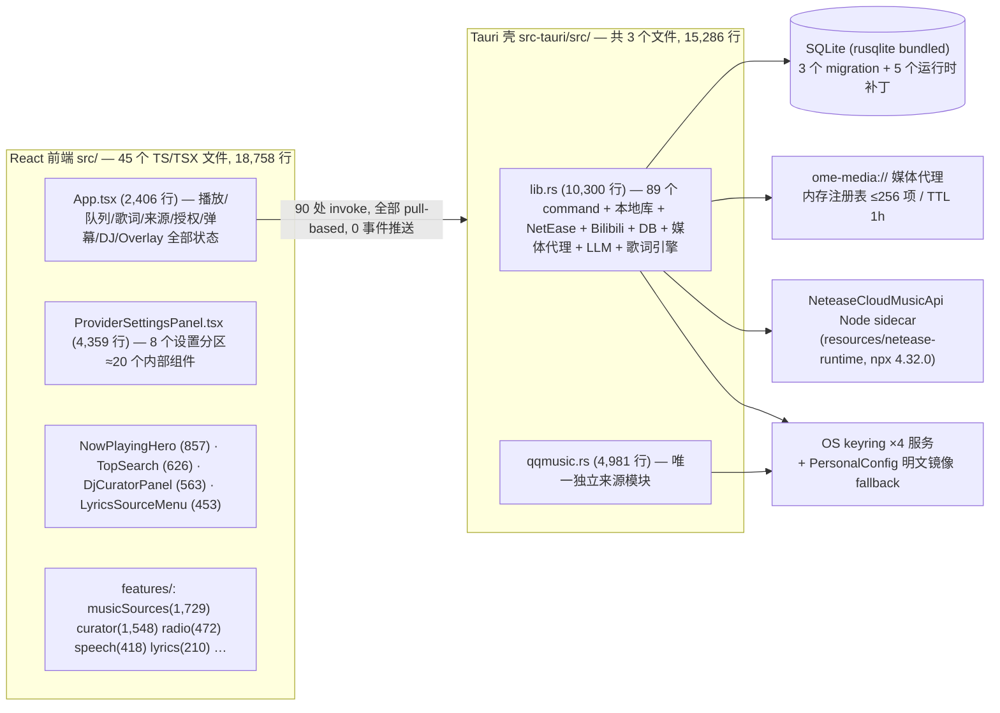

# Ome Music Phase 0 — 冻结基线与现状审计

> 按《OME_MUSIC_V1_AGENT_MASTER_GUIDE.md》Phase 0 要求产出：只审计，不重构。
> 日期：2026-09-10 · 基线 HEAD：`069a7fd`（main）· 版本：0.3.8（package.json / Cargo.toml / tauri.conf.json 三处一致）
> 未提交变更：`src/components/NowPlayingHero.tsx`（无歌词空态文案/透明度微调，3 insertions / 6 deletions，属 UI 打磨，不影响审计结论）
> 未跟踪文件：`PROJECT.md`、`ARCHITECTURE.md`、`DECISIONS.md`、`docs/design/`、`.agents/`
> **冻结状态（2026-09-11 更新）**：以上未提交/未跟踪资产已全部入库（`3968ae5` UI 微调、`9fe20f5` 文档、`2fcf3f5` agent 技能），锚点标签 **`v1-phase0-baseline`** 已建立在 `2fcf3f5`。其后的提交均为 Phase 0 附加产出（性能采样工具、CSP 播放阻塞修复 229fde5、本文档实测数据），不属于基线代码。
> 运行时性能基线已于 2026-09-11 实测补齐（见 §5），Phase 0 关闭，可进入 Phase 1A。

---

## 1. 系统架构总览



要点：
- **前后端通信 100% pull-based**：Rust 侧 `emit` 为 0 次；QQ 登录 9 态状态机等只能靠前端轮询。
- **唯一 managed state**：`AppState`（lib.rs:50-58），7 把锁，其中**单把全局 `Mutex<Connection>` 串行化全部 DB 访问**。
- **无来源抽象**：整个 crate `trait ` 出现 0 次；89 个 command 中 NetEase 25 / QQ 23 / Bilibili 14，同一套概念（QR 登录、config get/save、search、metadata、playable-url、import）在三个来源各实现一遍。

## 2. 前端：App.tsx 职责分析（重构最大风险点）

`src/App.tsx`：2,406 行；逻辑区 235–1939，JSX 区 1940–2406。

| 指标 | 值 |
|---|---|
| useState | 40 个（243–351 行连续声明，混合快照恢复/库/音频/歌词/Overlay/三来源授权/弹幕/Onboarding/电台/音质） |
| useEffect | 20 个（其中 491–620 一个 effect 混合启动恢复 + 三来源登录 bootstrap） |
| useRef / useCallback / useMemo | 25 / 14 / 4 |
| 职责域 | 播放引擎+重试预算、队列、歌词解析/导入、NetEase+Bilibili+QQ 授权、弹幕（32 个 ref）、DJ 电台 TTS、视频氛围、Overlay 状态机、封面水合、快照持久化 |

组件依赖拓扑（props 下传，无 Context、无状态库、无虚拟化库）：

```text
App (全部状态)
 ├─ NowPlayingHero (~35 个 props) ── DanmakuAtmosphereLayer(视频氛围)
 ├─ TopSearch (onPlayLocal/NetEase/Bilibili/QQMusic 四个独立回调)
 ├─ QueueDrawer / LyricsSourceMenu(兼 quickSettings) / PlayerControls
 ├─ lazy: ProviderSettingsPanel / DjCuratorPanel / GlobalDanmakuAtmosphereLayer
 └─ 内联: PlaybackNotice / EnvironmentPrompt / 两个 Fallback (App.tsx 2219–2330)
```

已知耦合证据：
- **音频元素命令式**（App.tsx:629 `new Audio()`），`timeupdate` → `setProgressSeconds` → **整棵 App 树以约 4Hz 全量重渲染**，扩散到 NowPlayingHero、两层弹幕层、DjCuratorPanel。
- 来源分支：严格 `source ===` 条件 37 处（App 18 / LyricsSourceMenu 7 / PSP 4…）；关键词耦合密度：ProviderSettingsPanel 624 次、musicSources/provider.ts 234 次、App 163 次、TopSearch 133 次。
- 设置入口重复：7 条路径汇入同一 `openProviderSettings()`；LyricsSourceMenu 重复渲染 debug/服务状态/三来源登录态。
- 死代码：`src/musicUnderstanding/`（671 行，`createMusicAnalyzer()` 无任何调用方）；`data/mockLibrary.ts` 仍被生产路径 `features/library/libraryApi.ts:2` 引用。

## 3. Rust：lib.rs 模块图与职责分析

`lib.rs` 10,300 行按行段拆解（证据为行号区间）：

```text
lib.rs (10,300)
├─ 903–3800   89 个 #[tauri::command] 全部在此（QQ 命令转发 qqmusic.rs）
├─ 3801–4460  本地库扫描 (walkdir + lofty) + 封面 data: URL 内嵌
├─ 4457–4646  5 个运行时 ensure_* 表补丁（与 migration 双轨并存）
├─ 4647–4800  LLM keyring + 明文 fallback
├─ 4804–5257  NetEase / Bilibili token 存取（keyring + PersonalConfig 明文镜像）
├─ 5258–6470  Bilibili 客户端：cookie 合并、WBI 签名、弹幕 XML deflate
├─ 6364–6853  ome-media:// 代理（整包读入 Vec<u8>，无流式、无磁盘缓存）
├─ 6854–7161  NetEase Node sidecar 托管（tokio mutex 单飞）
├─ 7206–8171  NetEase fetchers + 音质阶梯
├─ 8172–8473  歌词缓存 + sidecar LRC 模糊匹配
├─ 8474–8717  歌单导入 / JSON 映射
├─ 8718–8893  OpenAI 兼容 LLM 端点
├─ 8894–9787  taste notes / 用户画像计算
├─ 9788–10158 20 个单元测试
└─ 10160–10300 run_inner 启动装配

qqmusic.rs (4,981)：签名/cookie/URL 信任/搜索/metadata/vkey 阶梯/歌词/歌单/WebView2 登录/23 个测试
```

- 命令分布：App/本地库 12 · 画像/心情 7 · NetEase 25 · QQ 23 · Bilibili 14 · LLM 6 · 其他 2 = **89**。
- 依赖：498 包 resolved；`reqwest 0.12`（直连）与 tauri 自带 `reqwest 0.13` **双 HTTP 栈并存**；`webview2-com + windows` 仅服务于 QQ cookie 提取；rusqlite bundled。无 ffmpeg/sqlx/native-tls。

## 4. 数据与凭据路径（仅机制，未读取任何凭据内容）

- keyring v3（windows-native）：`ome.music.provider` / `ome.music.source.{netease,bilibili,qqmusic}`，账号 `local`；QQ 保存带读回验证。
- 明文镜像 fallback：`<cwd>/PersonalConfig/` 下 `netease_session.local` 等（lib.rs:5058-5071, 5242-5256, 4774-4798），fallback-first 读取（4766/5050/5234）。`PersonalConfig/` 已 gitignore，当前仅 1 个文件。**已记录为 P1 安全事项（DEC-002）**。
- QQ WebView2 登录：`ICoreWebView2_2::CookieManager` 收割 cookie（仅 Windows）；`QQMusicLoginFlow` 状态机只携带计数/布尔，无凭据值。
- SQLite：3 个 migration + 5 个运行时补丁双轨；弹幕缓存 50MB 上限 LRU 修剪；歌词缓存在 DB；**封面以 data: URL 内嵌 tracks 表**（违反 size-budget「no blobs in SQLite」自定规则）。

## 5. 性能基线

### 已测量（本次实测）

| 项 | 值 |
|---|---|
| 前端构建 | tsc ✓ + vite build ✓，1,665 模块，5.31s |
| Bundle 总量 | JS 473.8 kB raw / **gzip 146.2 kB**（主 chunk 336.5→105.6、设置面板 92.4→24.4、DJ 面板 38.5→13.2、弹幕层 5.0→2.2、provider 1.4→0.7） |
| CSS | 77.3 kB raw / 14.3 kB gzip |
| Rust | `cargo check` ✓ 4.72s（增量） |
| 仓库体积 | pack 2.48 MiB · 92 commits（近 30 天 19 个） |

### 静态代理指标（代码证据，替代尚未实测的运行时数据）

| 项 | 值 / 位置 |
|---|---|
| 位置更新渲染 | `timeupdate`→setState 全树重渲染 ~4Hz（App.tsx:984,1044）；快照保存 900ms debounce 挂在同一 setState 链上（441–450） |
| setInterval | 5 个，全部在 ProviderSettingsPanel（1–2.2s 轮询） |
| requestAnimationFrame | 5 处；speech/provider.ts:201,226 为持续 rAF 麦克风电平循环（≥50ms 发射）；GlobalDanmakuAtmosphereLayer.tsx:84-98 每次 currentTime 变化跑 `querySelectorAll` 碰撞检测 |
| backdrop-blur | 21 处；氛围舞台另加 blur/saturate/sepia 滤镜（NowPlayingHero:796,821） |
| 视频 | 1 个 `<video>`（NowPlayingHero:801，Bilibili 氛围背景） |
| 列表 | 零虚拟化；TopSearch「show more」无上限增长；QueueDrawer 全量 map |
| **内存风险最大项** | ome-media 代理将**整个媒体 body 缓冲进 RAM 的 `Vec<u8>`**（lib.rs:6637-6815），无流式/Range 磁盘缓存；视频氛围即全片载入内存 |

### 运行时 CPU / 内存基线（2026-09-11 实测，release 构建 @ 229fde5 + CSP 修复）

环境：i7-13650HX（20 逻辑核）/ 16GB RAM / Windows 10.0.26200 / WebView2。采样：`scripts/perf/perf-sampler.ps1` 每 10s 一帧，进程树 = 主进程 + WebView2 全部子进程 + NetEase node sidecar；CPU% 为机器总量归一（100% = 全机满载）。原始 CSV 在仓库外 `D:\Download\ome-perf-baseline\`（samples-idle / samples-soak / samples-netease.csv）。汇总工具：`scripts/perf/summarize.mjs`。

| 场景 | 时长 | CPU 中位 / p95 | 内存（主+WebView private+sidecar WS） | 结论 |
|---|---|---|---|---|
| Idle（暂停，应用可见） | 10 min / 58 样本 | **0.03% / 0.12%** | 稳定 ~715 MB（首样本 828MB 为启动余量，自然回落） | Idle 极安静，无异常占用 |
| 本地播放（WAV 列表循环） | 30 min / 174 样本，0% 最小化 | 0.04% / 0.47% | 558→597 MB（斜率 0.55 MB/min，主要是 WebView 预热） | 本地播放成本极低；**注意：该段后 27 分钟队列推进卡死在不可播曲目上（见 P1-7），实际有效本地播放约前 3 分钟** |
| NetEase Hi-Res 流媒体播放（有效段） | ~12 min / 50 样本 | **1.36% / 1.69%** | 796→峰值 869 MB（+73MB），停止后回落至 ~777 MB | 流媒体 + Hi-Res 解码 + 歌词 + 代理整链路约 1.4% 机器 CPU；**15 分钟窗口内未见无界增长，峰值后可回收**——但 30 分钟以上长 soak 仍待补（队列卡死 P1-7 使其无法在坏曲目清理前完成） |
| NetEase 段内卡死（队列推进至不可播曲目后静默暂停） | 剩余 ~18 min | 0.03% / 0.07% | 峰值 869 回落至 776 | 复现 P1-7 |

Bundle / 构建基线（此前已测）：JS 473.8 kB raw / 146.2 kB gzip；CSS 77.3 kB；`cargo check` 4.7s 增量。

### 测量过程中发现并处理的问题（Phase 0 附加产出）

1. **P0（已修复并提交 `229fde5`）：发行版构建本地音乐完全无法播放。** `tauri.conf.json` CSP 的 `media-src` 缺少 `asset:` / `http(s)://asset.localhost`（img-src 有），而 Tauri 仅在 release 构建注入 CSP → 本地音频全部被拦截，audio error 走兜底逻辑显示误导性的「This track is unavailable from the current source」（Rust 侧 `file_missing` 检查与该现象无关，文件实际存在）。Dev 模式无 CSP 因此从未暴露。修复为 media-src 补上 asset 协议，重建后本地播放验证通过。**基线标签 `v1-phase0-baseline` 在修复之前，发布版 0.3.8 均受此影响。**
2. **P1-7（新）：队列自动推进不跳过不可播曲目，且失败静默。** 恢复的 1051 项队列中混有 5 首 QQ 残留曲目（DB 中带**已过期的签名 vkey 直链**——瞬态 URL 持久化反模式）与不可播 NetEase 条目；播放推进到这些曲目即静默暂停（QQ 报 `no_copyright`，重试耗尽无 UI 提示），整个播放停止。30 分钟 soak 两次被此中断。这也使「队列 100/1000」场景失去意义：当前队列即 1051 项，痛点不是渲染而是可用性。
3. **P1-8（新）：NetEase sidecar 启动竞态。** 应用启动时托管的 node 服务可能未绑定 3000 端口（spawn 竞态/前实例端口残留），表现为所有 NetEase 可播 URL 解析静默挂起、无错误提示；设置面板的「重新检测」可恢复。首启健康检查与实际监听状态不闭环。
4. **P2（新）：QQ 登录状态轮询噪声。** UI 显示「会话已保存」时，后台仍反复全量远程验证 QQ 会话（每次 3 种方式网络尝试），持续刷 stderr。idle CPU 未受明显影响，但属于无意义的持续网络/日志开销。
5. **P3（新）：使用指南文案漂移。** 「聚焦搜索框出现 Choose Music Folder 按钮」已不成立——该按钮现仅存在于空库空态与 Onboarding（且 Onboarding 步骤文案与实际入口路径不一致）。
6. 测量环境备注：本机存在代理工具（Fake-IP 198.18.0.0/16 路由）与外部窗口最小化干扰；采样脚本已带窗口恢复逻辑与 minimized 标记列，本轮有效段均确认 0% 最小化。PowerShell `Add-Type` 在本机因 `LIB` 环境变量失效不可用，采样器窗口恢复改用 `Process.Restore()`。

### 遗留的测量缺口（Phase 1A 前补齐即可，不阻塞开工）

- NetEase 连续 30 分钟不中断 soak（需先清理队列中不可播曲目或实现自动跳过）。
- Bilibili 视频氛围、弹幕开启场景、队列 100/1000 渲染帧率（当前 1051 项队列已可作现成样本）。
- ome-media 代理大文件（长视频）内存曲线的定量记录。

## 6. 测试与质量门清单

| 门禁 | 内容 | 运行位置 |
|---|---|---|
| Vitest | 5 文件 28 用例（ArtworkImage 4、QueueDrawer 5、resolveTrackCover 5、lyricsResolver 8、qqMusicAuthPresentation 6） | **仅本地，CI 不跑** |
| regression-check.mjs | 417 行，79 条**纯静态正则断言**（精确 JSX/CSS 字符串） | **仅本地，CI 不跑** |
| Rust | 43 `#[test]`（lib 20 + qqmusic 23）；无集成测试目录 | CI（ubuntu + windows 双跑） |
| CI 4 jobs | cargo check/clippy -D warnings/fmt/test · windows check/test · tsc+lint+format+build · docs:check（PR only） | ✓ |
| 缺口 | **无 e2e/Playwright**；CI 不含 `npm run test`；无 pre-commit hook | — |

质量文档现状：`AUDIT_FINDINGS`（自称 P0 清零）、`FINAL_REPORT_v0.4.0`（86/100，App.tsx 单列为 open P2）、`REMEDIATION_EXECUTION_REPORT`（7 项人工门未勾）、`QA_CHECKLIST_v0.4.0`（40 项人工 QA 未勾）。**全部 v0.4.0 命名文档与 0.3.8 版本事实不符，且数字普遍过时（测试数、App.tsx 行数）。** docs/design/（未跟踪）为 2026-09-09 视觉走查：3 个 P1 已修，open P2×3（首启动 UNABLE-TO-PLAY 徽标、可维护性、小窗口拥挤）。

## 7. 技术债清单（按总指导附录 B 分级）

**P0：无未决项**（播放可用、无已知崩溃/数据丢失/泄露路径；以现有审计文档 + 本次复核为准）。

**P1**
1. NetEase 明文 session 镜像（PersonalConfig fallback-first，DEC-002 已跟踪）— 安全。
2. ome-media 代理全量 RAM 缓冲：长音频/视频直接线性吃内存 — 稳定性 + 性能。（实测：Hi-Res 流媒体 12 分钟窗口内未见无界增长，见 §5；长视频场景待定量）
3. 位置更新 ~4Hz 全树重渲染 + 弹幕层 rAF 碰撞检测叠加 — 低端机卡顿风险。（实测绝对值：全机 ~1.4% CPU @20 核，绝对量低于预期，优先级可让位于下述可用性问题）
4. CI 不跑 Vitest 与 regression-check：回归防线实际不在 CI 里。
5. regression-check 100% 静态精确字符串断言，已在 v0.4.0 期间漂移过一次（P0-1）；**App.tsx 一动即碎**。
6. 全局单 `Mutex<Connection>` 串行化 DB；无 RwLock/分片。
7. **（实测新增）队列推进不跳过不可播曲目 + 失败静默**：恢复队列混有 5 首 QQ 过期 vkey 直链曲目与失效 NetEase 条目，推进到即静默暂停整个播放，无 UI 提示、无自动跳过。
8. **（实测新增）NetEase sidecar 启动竞态**：spawn 后可能未真正监听 3000 端口，可播 URL 解析静默挂起；仅设置面板「重新检测」可恢复。

**P2**
7. App.tsx 2,406 行 / 40 useState / 20 effects，6+ 职责域混居。
8. ProviderSettingsPanel 4,359 行 ≈20 组件；lib.rs 10,300 行三来源混居；crate 内 0 个 trait。
9. 来源逻辑三倍重复（QR 登录/config/search/metadata/playable-url/import ×3）；无 capability 模型，前端 37 处 `source ===`。
10. schema 双轨演化（3 migration + 5 运行时补丁）。
11. 封面 data: URL 内嵌 DB 行（违反自定 size-budget 规则）。
12. reqwest 0.12/0.13 双栈编译进二进制。
13. 队列/搜索列表零虚拟化。
14. 死代码 musicUnderstanding 671 行 + mockLibrary 进生产 import；重复设置入口 7 条路径。
15. 后端 0 事件推送，登录流全靠轮询。
16. 文档层版本错位（v0.4.0 命名 vs 0.3.8）+ 数字过时；NeteaseCloudMusicApi 挂在 root dependencies 但实际独立 vendored。

**P3**：未门控的 `eprintln!`、AUDIT_FINDINGS 文档重复段落、单歌词预设、WebView2 cookie 按 domain+name 过滤等（FINAL_REPORT 已列）。

## 8. 迁移风险

1. **回归门脆弱性**（最高）：先重写 regression-check 为行为测试，再动 App.tsx，否则护栏与重构互相摧毁。
2. **凭据/session**：keyring + PersonalConfig 镜像路径在重构中不得触碰读取逻辑；QQ 贡献者域按附录 C 冻结为 Experimental，只保接口。
3. **NetEase sidecar**：prepare:netease-runtime + npx 托管链路是启动关键路径，搬运时保持单飞锁语义。
4. **Windows-only 路径**：webview2 代码依赖 CI windows job；本地验证必须在 Windows 做。
5. **无 e2e**：UI 重构验证只有截图 + 人工；Phase 4 前需补最小 Playwright smoke（TODO 文档已规划）。
6. **文档漂移**：现有质量文档数字失真，1.0 期间以代码 + 本文档为事实源，避免被旧报告误导。
7. **未提交工作区**：NowPlayingHero 微调需先落盘（commit 或 stash）再开分支，避免基线不洁。

## 9. 1.0 重构计划（Phase 1 起的落地映射）

> 分支建议 `refactor/v1-foundation`；每阶段可编译、可启动、可回滚；每阶段产出按总指导附录 A 模板汇报。

| 阶段 | 内容（本文档证据支撑） | 退出标准 |
|---|---|---|
| **P1 Foundation** | ① 先把 regression-check 关键契约重写为 Vitest 行为测试并**进 CI**（化解风险 1+P1-4）② `src/core|ui/tokens` 设计 tokens、typed event bus、core IPC 封装、error model、SourceCapability 类型（纯新增，UI 不变）③ 清死代码：musicUnderstanding、mockLibrary 生产引用 | CI 全绿含新测试；App.tsx 行数不减但不增；tokens 无 UI 变化 |
| **P2 Playback Core** | PlaybackEngine external store：position 走 store 订阅不再进 React props；audio 生命周期唯一归属；retry/cancel 预算收敛；预留 DJ transition 钩子 | 本地/NetEase/Bilibili A→B→A；like/queue 不串；30min soak；4Hz 全树重渲染消除（对照 §5 基线） |
| **P3 Source Architecture** | Rust 侧引入 `MusicSourceAdapter` trait，netease/bilibili/qqmusic 迁出 lib.rs 成 `sources/` 模块；89 command 收敛为按 capability 分组；auth 统一 AuthState 状态机；keyring-only（收敛明文镜像，P1-1） | lib.rs < 3,000 行；新增来源不需改 App；P1-1 关闭 |
| **P4 UI 1.0** | Listening Room / PlayerDock / Lyrics Room / Queue / Settings 四组收束（7 入口→1）；ProviderSettingsPanel 拆分；虚拟化队列；严格走 Implement→Run→Screenshot→Visual Review→Fix | 人工 QA 清单通过；docs/design P2 三项关闭 |
| **P5 DJ Core** | 现 curator/radio（features/curator 1,548 + speech 418）升级为 DJ Planner + transition scheduler + TTS 抽象 + ducking + 静默降级；先固定文本后接 LLM | DJ 失败不阻塞切歌（可注入故障验证） |
| **P6 Memory** | taste memory / explicit memory 收敛现有 taste notes(8894–9787) 与 mood 表；可查看/删除 | 记忆面板可解释可清除 |
| **P7 Performance** | 补测 §5 运行时基线 → 流式媒体代理（P1-2）→ blur/动画预算 → 1000 项队列 | 全部指标有 Before/After |
| **P8 Release** | 架构/产品/安全/性能门 + 40 项人工 QA → `1.0.0-rc.1` | 总指导第十七部分全绿 |

**下一步（Phase 1A 第一批动作，基线已冻结、运行时基线已实测，待维护者批准后执行）**：建 `refactor/v1-foundation` 分支 → regression 契约行为化 + CI 补 `npm run test` → 最小 Playwright smoke → 性能采样脚本入库（已完成，`scripts/perf/`）。建议 Phase 1A 同期修复 P1-7（不可播曲目自动跳过）与 P1-8（sidecar 健康闭环），它们直接决定 1.0 的「Reliability Is Part of Design」。
